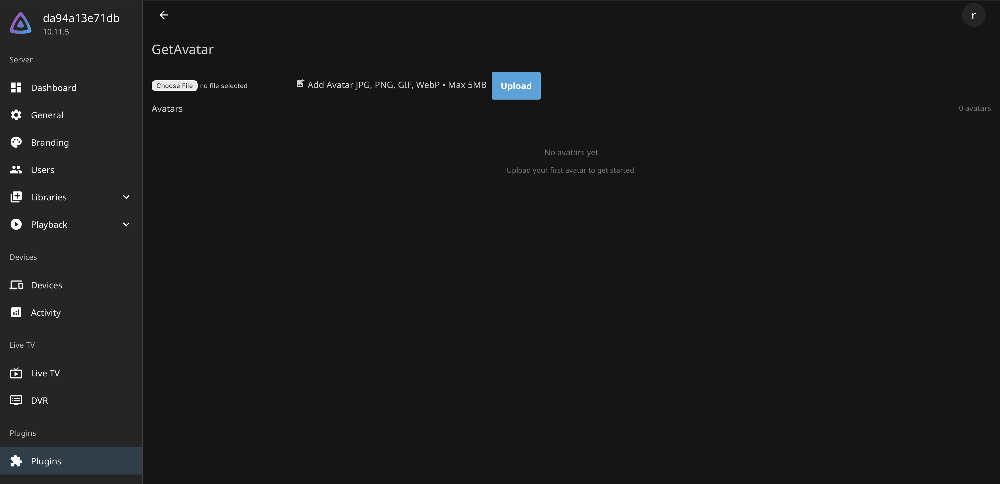
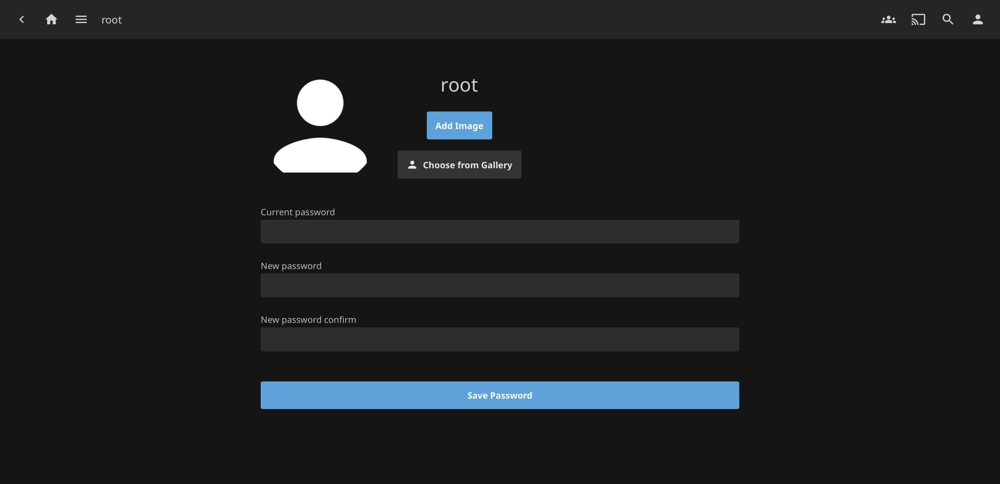
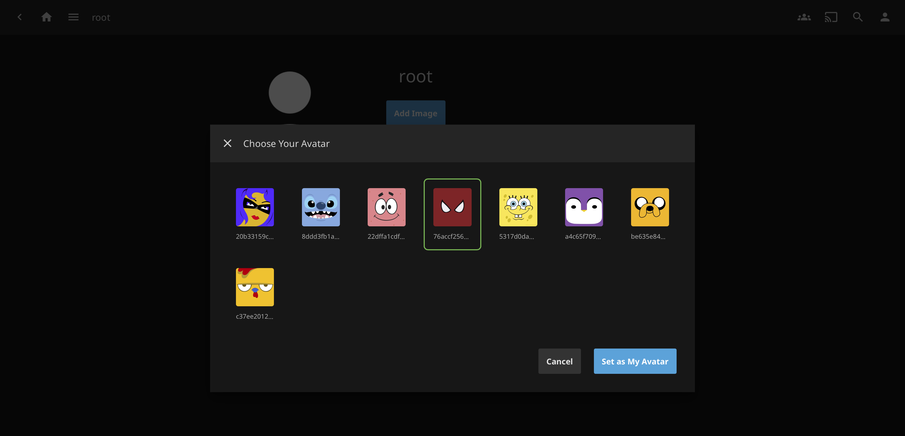

# Jellyfin Plugin GetAvatar

Jellyfin plugin that allows users to choose an avatar from a collection of images.


# About

This plugin allows users to choose an avatar from a collection of images. The plugin is installed in the Jellyfin server and provides a button in the user profile to select an avatar.

> [!NOTE]
> v1.4.0 stable version (test on jellyfin version 10.11.6)

## Installation

1. You have to open the dashboard of your Jellyfin server. Go to Catalog, click on ⚙️ button.
2. Click to + to add the URL.

```bash
https://raw.githubusercontent.com/cedev-1/Jellyfin-Plugin-GetAvatar/master/manifest.json
```

3. On the Catalog page click on Install.

## Plugin Configuration

You just have to add avatar images, click on "Choose file" and "Upload". The image will be added to the collection of images. You can also remove images by clicking on the cross icon.



## User View

User profile page will have a new button "Choose Your Avatar".





## Disclaimer

It may have some bugs. If you find any bug, please open an [issue](https://github.com/cedev-1/jellyfin-plugin-GetAvatar/issues).

## License

MIT
