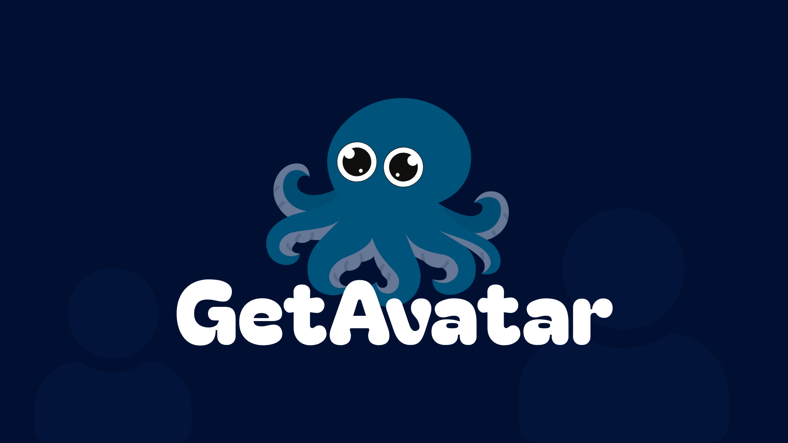

# Jellyfin Plugin GetAvatar

Jellyfin plugin that allows users to choose an avatar from a collection of images.



# About

This plugin allows users to choose an avatar from a collection of images. The plugin is installed in the Jellyfin server and provides a button in the user profile to select an avatar.

> [!NOTE]
> Tested with Jellyfin 10.11.0 and 10.11.10.
> Expected to work across Jellyfin 10.11.x.

## Installation

1. You have to open the dashboard of your Jellyfin server. Go to Catalog, click on ⚙️ button.
2. Click to + to add the URL.

```bash
https://raw.githubusercontent.com/cedev-1/Jellyfin-Plugin-GetAvatar/master/manifest.json
```

3. On the Catalog page click on Install.

## Plugin Configuration

You just have to add avatar images, click on "Choose file" and "Upload". The image will be added to the collection of images. You can also remove images by clicking on the cross icon.


## User View

User profile page will have a new button "Choose from Gallery".


## Avatar

> [!TIP]
> Now, since version 1.6.4.0, you can directly import avatars with one click from the plugin's configuration interface.

You can import avatar packs from the repository [jellyfin-avatars](https://github.com/cedev-1/jellyfin-avatars) or direct download from [web page](https://cedev-1.github.io/jellyfin-avatars/). 


For example, you can import this [Netflix avatar pack](https://imgur.com/gallery/netflix-all-profile-icons-ToZ21Gg).

## Disclaimer

It may have some bugs. If you find any bug, please open an [issue](https://github.com/cedev-1/jellyfin-plugin-GetAvatar/issues).

# Troubleshooting

It is possible that on already active sessions the button is not displayed on the profile. You can clear your browser cache.

## License

[MIT](./LICENSE)
